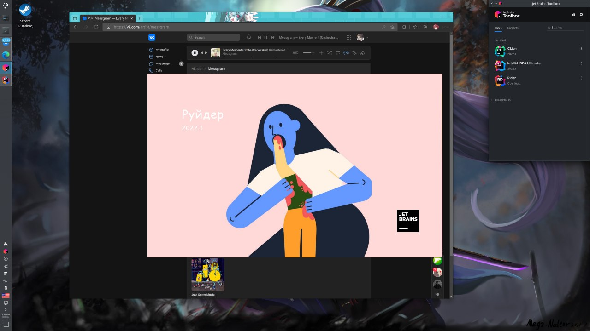

# SuckMySplashUp

## WTF is this?

Kinda shitpost POC to patch splash screen in app.jar for IDEA based IDE



(Image is a reference to [Saturn Devouring His Son](https://en.wikipedia.org/wiki/Saturn_Devouring_His_Son) I dunno who original author of this remake)

## Which IDEs is tested?

- Rider 2022.1.1
- Clion 2022.1
- IDEA (All editions) 2022.1

## How to use it?

Just build __Keroosha.SuckMySplashUp.CLI__ and run with args:

```bash
./SuckMySplashUp \ 
--app "${localsharepath}JetBrains/Toolbox/apps/Rider/ch-0/221.5591.20/lib/app.jar" \
--splash splash.png \
--splash2 splash@2x.png
```

You can specify only __--splash__ or __--splash2__ this is fine too

## TODO
- [x] IDEA DOESN'T WORK for now, splash screen hidden somwhere else, I'll find it __soon™__
- [ ] Cross-platform App (Preferred AvaloniaUI)


## Contribution

If you interested to help me with this quest - contact me at [Dotnet.ru TALKS community](https://t.me/dotnettalks) via mention @Keroosha

I don't read PM from strangers at Telegram, so, ping me at chat first!

Also - feel free to ask people at chat even if you don't know Russian (Most of the chat members know English), they can (probably) help before me
